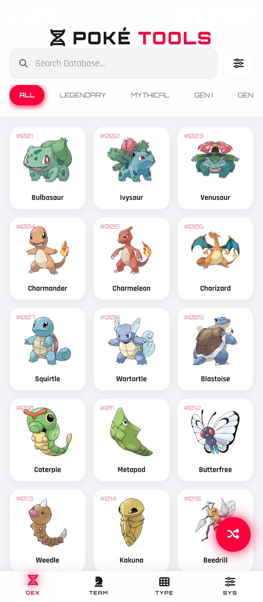
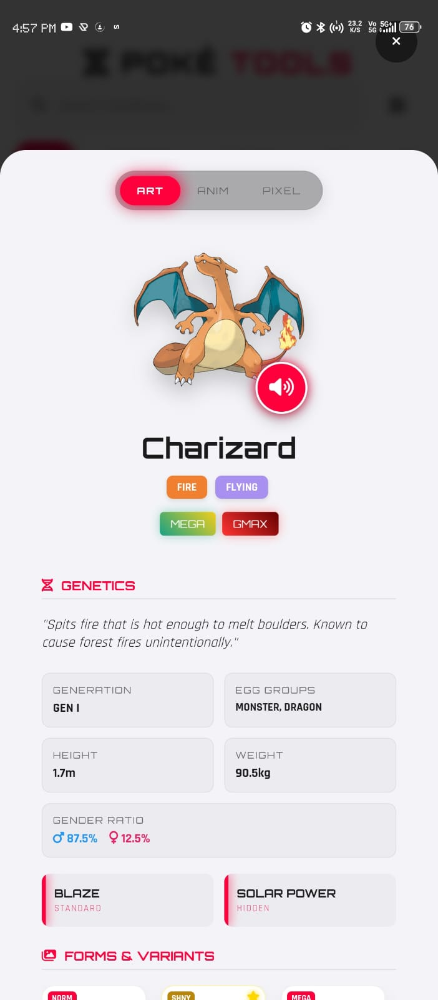
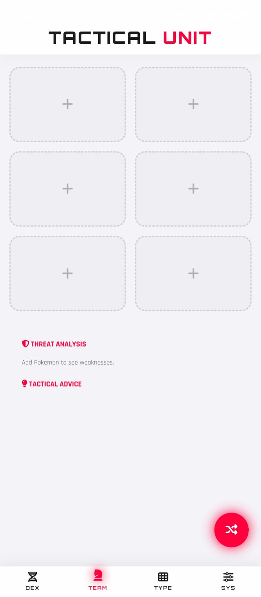
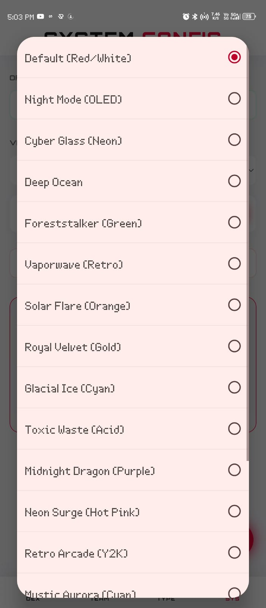

<h1>🧬 POKÉTOOLS</h1>
<b>The Ultimate Open-Source Pokémon Companion App</b>

<a href="#-features">Features</a> •<a href="#-tech-stack">Tech Stack</a> •<a href="#-screenshots">Screenshots</a> •<a href="#-getting-started">Getting Started</a>

Pokétools is a modern, feature-rich companion app built for fans who want detailed data, tactical analysis, and a stunning UI without the bloat.Engineered with Vanilla Web Technologies and Capacitor, it delivers a native 60fps experience on mobile devices with 100% Offline Capability.✨ Features<table><tr><td width="50%"><h3>📱 Native-Feel Glassmorphism UI</h3>
A beautiful, responsive interface featuring smooth animations, glass-panel aesthetics, and haptic feedback interactions.
</td><td width="50%"><h3>⚔️ Tactical Team Builder</h3>
Build your dream team and get real-time <b>Threat Analysis</b>. The app calculates shared weaknesses and suggests counter-types instantly.
</td></tr><tr><td width="50%"><h3>💾 Full Offline Architecture</h3>
Download the entire database—including Moves, Abilities, and Sprites—to your device. Zero lag, zero internet required after sync.
</td><td width="50%"><h3>🎨 Dynamic Theme Engine</h3>
15+ themes including <i>OLED Dark</i>, <i>Cyber Glass</i>, <i>Vaporwave</i>, and character-specific themes like <i>Charizard</i> & <i>Pikachu</i>.
</td></tr></table>🧬 Advanced Data SuiteDeep Move Analysis: Search moves with category filters (Physical / Special / Status).Evolution Charts: Interactive trees showing exact evolution conditions.Sprite Toggles: Switch between Official Art, Pixel Art, and Animated Showdown Sprites.Type Matrix: Comprehensive type effectiveness calculator.📸 Screenshots
<table><tr><td align="center" width="25%"><b>Dex View</b></td><td align="center" width="25%"><b>Detail View</b></td><td align="center" width="25%"><b>Team Builder</b></td><td align="center" width="25%"><b>Themes</b></td></tr></table>
🛠️ Tech StackThis project was built to demonstrate how powerful Vanilla JS can be without heavy frameworks.
CoreRuntimeData & Storage
🚀 Getting StartedThis project is fully open-source!PrerequisitesNode.js & npmAndroid Studio (for Android builds)Xcode (for iOS builds)InstallationClone the repogit clone [https://github.com/YourUsername/poketools.git](https://github.com/YourUsername/poketools.git)
cd poketools
Install Dependenciesnpm install
Run LocallySince this is a vanilla project, you can simply serve the index.html file using any static server. To test native plugins:npx capacitor run android
# OR
npx capacitor run ios
🤝 ContributingContributions are always welcome!Fork the ProjectCreate your Feature Branch (git checkout -b feature/AmazingFeature)Commit your Changes (git commit -m 'Add some AmazingFeature')Push to the Branch (git push origin feature/AmazingFeature)Open a Pull Request

Built with ❤️ by <b>Bhoid</b>

<i>This project is unofficial and is not affiliated with Nintendo, Game Freak, or The Pokémon Company.</i>

